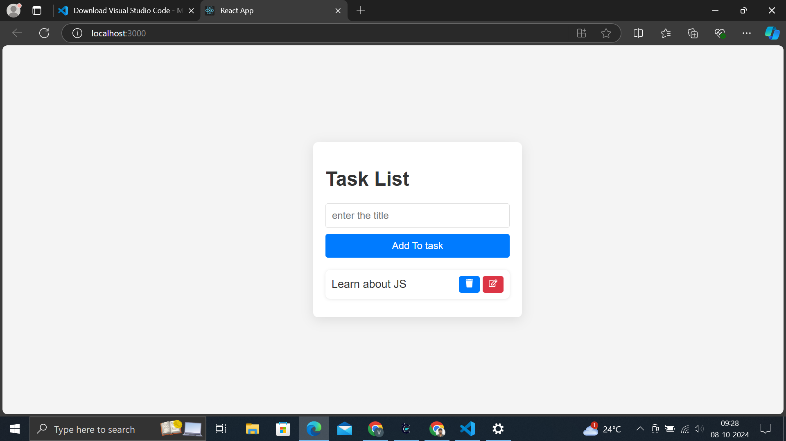

📝 Task List App with TypeScript and React
This project is a simple Task List Application built using React and TypeScript, where users can perform CRUD (Create, Read, Update, Delete) operations on tasks.

# Sample Screen 


🚀 Features
Create Tasks 🟢: Add new tasks using the form input.
Edit Tasks 🟡: Update existing tasks by clicking the edit button.
Delete Tasks 🔴: Remove tasks from the list.
Responsive UI 📱: The design is simple, responsive, and mobile-friendly.

🛠️ Technologies Used
React
TypeScript
CSS for styling
React Icons for UI icons

⚡ Getting Started
Prerequisites
Make sure you have Node.js and npm installed on your machine:

Download Node.js

## Installation

To run this project locally, follow these steps:

### Prerequisites

Make sure you have the following installed:

- **Node.js**: Version 14 or higher
- **npm**: Node package manager (comes with Node.js)

### Steps

1. **Clone the repository**:
   ```bash
   git clone https://github.com/RVJVIJAY/Typescript-tasklist.git
2.**Navigate to the project directory:**

     cd todo
3.**Install dependencies using npm or yarn:**

    npm install
4.**Start the development server:**

    npm start 
5.**Open the app in your browser:**

    Once the development server is running, open http://localhost:3000 to view the application in your browser.


📝 How It Works

1.Add Task:
Enter a task in the input field and click "Add To Task" to create a new task.

2.Edit Task:
Click the 🖉 edit icon next to any task to load its value into the input field. Make changes and click "Update Task" to save.

3.Delete Task:
Click the 🗑️ trash icon to delete the task from the list.
